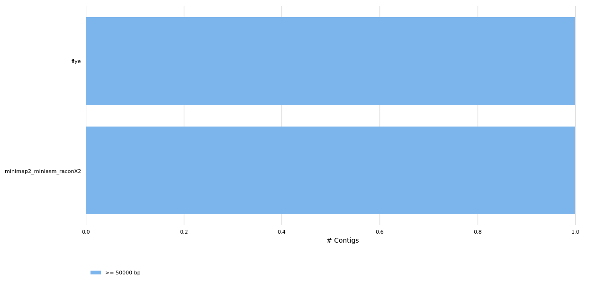
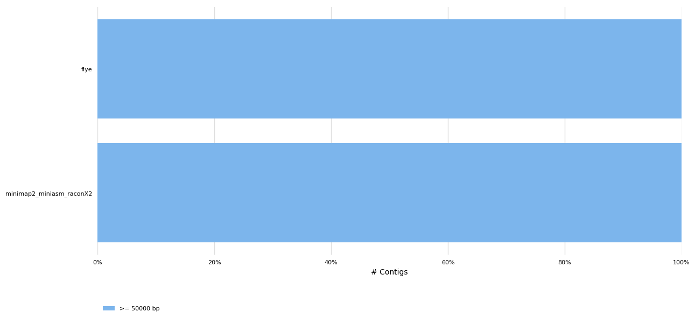
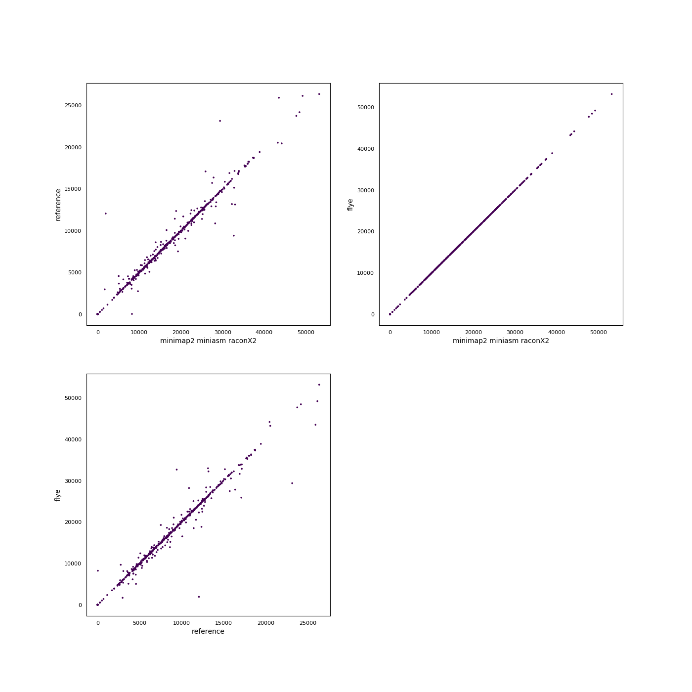
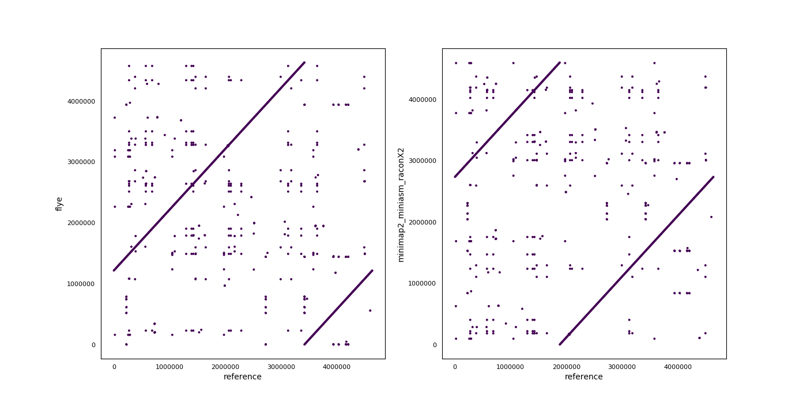

# Assembler benchmark for ONT MinION data
#### Authors: Carlos de Lannoy, data from data from [Loman Labs](http://lab.loman.net/2017/03/09/ultrareads-for-nanopore/)
Generated using [poreTally](https://github.com/cvdelannoy/poreTally), a benchmarking tool. For an interactive version of this report, download REPORT.html from this repository.

<h2>Abstract</h2>The MinION is a portable DNA sequencer that generates long error-prone reads. As both the hardware and analysis software are updated regularly, the most suitable pipeline for subsequent analyses of a dataset generated with a given combination of hardware and software for a given organism is not always clear. Here we present a benchmark for a selection of <i>de novo</i> assemblers available to MinION users, on a read set of <i>Escherichia coli</i> (NCBI taxID: 562). This benchmark is based on a <a href=\>benchmarking routine</a>, designed to facilitate easy replication on a read set of choice and addition of other <i>de novo</i> assembly pipelines.<h2>Methods</h2><h3>Readset quality assessment</h3>Reads in this dataset were generated on a Minion with FLO-MIN106 flowcell with SQK-LSK108 kit. The reads were basecalled using Albacore 2.2.7. Prior to assembly, the quality of the untreated readset was analysed using NanoPlot (version: 1.18.1) and mapped using the mappy module (version: None) in Python3.<h3>Assembly pipelines</h3><h4>flye</h4>Flye uses A-Bruijn graphs to assemble long error-prone reads. To do so, it follows arbitrary paths through the assembly graph and constructs new assembly graphs from these paths. &zwnj; &zwnj;<b>Included tools:</b><ul><li>flye (version: 2.3.5-release) </li></ul> &zwnj;<b>Used command:</b><pre><code>flye --nano-raw {input.fastq} --genome-size 4641652 --out-dir . --threads 16
mv scaffolds.fasta {output}
</code></pre><h4>minimap2 miniasm raconX2</h4>Minimap2 is a fast all-vs-all mapper of reads that relies on sketches of sequences, composed  of minimizers. Miniasm uses the found overlaps to construct an assembly graph. As a consensus step is lacking in this pipeline, a post-assembly polishing step is performed using minimap2+Racon twice. &zwnj; &zwnj;<b>Included tools:</b><ul><li>minimap2 (version: 2.12-r827) </li><li>racon (version: v1.3.1) </li><li>miniasm (version: 0.3-r179) </li></ul> &zwnj;<b>Used command:</b><pre><code>minimap2 -x ava-ont -t 16 {input.fastq} {input.fastq} | gzip -1 > minimap2.paf.gz
miniasm -f {input.fastq} minimap2.paf.gz > minimap2_miniasm.gfa
grep -Po '(?<=S\t)utg.+\s[ACTG]+' minimap2_miniasm.gfa | awk '{{print ">"$1"\\n"$2}}' | fold > minimap2_miniasm.fasta
minimap2 -x ava-ont -t 16 minimap2_miniasm.fasta {input.fastq} > minimap2_readsToContigs1.paf
racon -t 16 {input.fastq} minimap2_readsToContigs1.paf minimap2_miniasm.fasta > minimap2_miniasm_raconX1.fasta
minimap2 -x ava-ont -t 16 minimap2_miniasm_raconX1.fasta {input.fastq} > minimap2_readsToContigs2.paf
racon -t 16 {input.fastq} minimap2_readsToContigs2.paf minimap2_miniasm_raconX1.fasta > {output}
</code></pre><h3>Assembly quality assessment</h3>Produced assemblies were analyzed and compared on continuity and agreement with the reference genome. Quast (version: 4.6.3) was used to determine a wide array of quality metrics in both quality categories and produce synteny plots. To elucidate any bias in the occurence of certain sequences, 5-mers in the assemblies and the reference genomes were compared using Jellyfish (version: 2.2.10). Finally, results were summarized using MultiQC.<h2>Results</h2><h3>General Statistics</h3><table>
<thead>
<tr><th style="text-align: center;">                        </th><th style="text-align: center;"> Wall time </th><th style="text-align: center;"> peak CPU usage PSS MB </th><th style="text-align: center;"> Genome fraction </th><th style="text-align: center;">    N50    </th><th style="text-align: center;"> Total length </th><th style="text-align: center;"> indels per 100 kbp </th><th style="text-align: center;"> mismatches per 100 kbp </th></tr>
</thead>
<tbody>
<tr><td style="text-align: center;">          flye          </td><td style="text-align: center;">  0:52:36  </td><td style="text-align: center;">        23436.2        </td><td style="text-align: center;">     99.998      </td><td style="text-align: center;">4.63456e+06</td><td style="text-align: center;"> 4.63456e+06  </td><td style="text-align: center;">       370.42       </td><td style="text-align: center;">         241.92         </td></tr>
<tr><td style="text-align: center;">minimap2_miniasm_raconX2</td><td style="text-align: center;">  0:21:42  </td><td style="text-align: center;">        13657.2        </td><td style="text-align: center;">     99.995      </td><td style="text-align: center;">4.60616e+06</td><td style="text-align: center;"> 4.60616e+06  </td><td style="text-align: center;">       592.75       </td><td style="text-align: center;">         148.64         </td></tr>
</tbody>
</table><h3>Readset quality</h3>
<table>
<thead>
<tr><th style="text-align: center;">                          </th><th style="text-align: center;"> Value </th><th style="text-align: center;">                 </th><th style="text-align: center;">    N    </th><th style="text-align: center;">  %  </th></tr>
</thead>
<tbody>
<tr><td style="text-align: center;"> <b>Mean read length</b>  </td><td style="text-align: center;">34732.5</td><td style="text-align: center;"><b>deletions</b> </td><td style="text-align: center;">73144266 </td><td style="text-align: center;">7.99 </td></tr>
<tr><td style="text-align: center;"> <b>Mean read quality</b> </td><td style="text-align: center;"> 10.7  </td><td style="text-align: center;"><b>insertions</b></td><td style="text-align: center;">19618119 </td><td style="text-align: center;">2.14 </td></tr>
<tr><td style="text-align: center;"><b>Median read length</b> </td><td style="text-align: center;">21866.5</td><td style="text-align: center;"> <b>matches</b>  </td><td style="text-align: center;">777876825</td><td style="text-align: center;">84.96</td></tr>
<tr><td style="text-align: center;"><b>Median read quality</b></td><td style="text-align: center;"> 11.2  </td><td style="text-align: center;"><b>mismatches</b></td><td style="text-align: center;">44938833 </td><td style="text-align: center;">4.91 </td></tr>
</tbody>
</table><h3>QUAST</h3><h4>Assembly Statistics</h4><table>
<thead>
<tr><th style="text-align: center;">                        </th><th style="text-align: center;"> N50 (Kbp) </th><th style="text-align: center;"> N75 (Kbp) </th><th style="text-align: center;"> L50 (K) </th><th style="text-align: center;"> L75 (K) </th><th style="text-align: center;"> Largest contig (Kbp) </th><th style="text-align: center;"> Length (Mbp) </th><th style="text-align: center;"> Misas- semblies </th><th style="text-align: center;"> Mismatches /100Kbp </th><th style="text-align: center;"> Indels /100Kbp </th><th style="text-align: center;"> Genes </th><th style="text-align: center;"> Genes (partial) </th><th style="text-align: center;"> Genome Fraction </th></tr>
</thead>
<tbody>
<tr><td style="text-align: center;">          flye          </td><td style="text-align: center;">4.63456e+06</td><td style="text-align: center;">4.63456e+06</td><td style="text-align: center;">    1    </td><td style="text-align: center;">    1    </td><td style="text-align: center;">     4.63456e+06      </td><td style="text-align: center;"> 4.63456e+06  </td><td style="text-align: center;">        2        </td><td style="text-align: center;">       241.92       </td><td style="text-align: center;">     370.42     </td><td style="text-align: center;"> 4312  </td><td style="text-align: center;">        1        </td><td style="text-align: center;">     99.998      </td></tr>
<tr><td style="text-align: center;">minimap2_miniasm_raconX2</td><td style="text-align: center;">4.60616e+06</td><td style="text-align: center;">4.60616e+06</td><td style="text-align: center;">    1    </td><td style="text-align: center;">    1    </td><td style="text-align: center;">     4.60616e+06      </td><td style="text-align: center;"> 4.60616e+06  </td><td style="text-align: center;">        2        </td><td style="text-align: center;">       148.64       </td><td style="text-align: center;">     592.75     </td><td style="text-align: center;"> 4312  </td><td style="text-align: center;">        2        </td><td style="text-align: center;">     99.995      </td></tr>
</tbody>
</table><h4>Number of Contigs</h4>

<h3> <i>k</i>-mer Counts</h3>

<h3> Synteny Plots</h3>

<h3>CPU usage</h3>

CPU usage was monitored during runs using the psutil package in Python3. Reported here are CPU time and memory usage(proportional and unique set size, PSS and USS respectively).<table>
<thead>
<tr><th style="text-align: center;"> I/O in (MB/s) </th><th style="text-align: center;"> I/O out (MB/s) </th><th style="text-align: center;"> Wall time </th><th style="text-align: center;"> mean CPU load (MB) </th><th style="text-align: center;"> peak PSS (MB) </th><th style="text-align: center;"> peak USS (MB) </th></tr>
</thead>
<tbody>
<tr><td style="text-align: center;">    2369.39    </td><td style="text-align: center;">    5018.72     </td><td style="text-align: center;">  0:52:36  </td><td style="text-align: center;">         0          </td><td style="text-align: center;">    23436.2    </td><td style="text-align: center;">     23436     </td></tr>
<tr><td style="text-align: center;">      3.9      </td><td style="text-align: center;">     360.34     </td><td style="text-align: center;">  0:21:42  </td><td style="text-align: center;">         0          </td><td style="text-align: center;">    13657.2    </td><td style="text-align: center;">    13657.1    </td></tr>
</tbody>
</table>